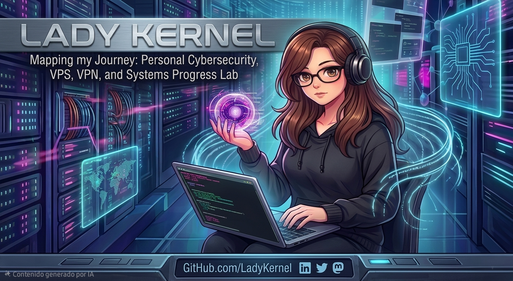

🛡️ MyIronGuard
Secure by design. Built by LadyKernel.

Bienvenido/a a MyIronGuard. Este repositorio documenta la configuración, despliegue y fortificación de mi infraestructura personal de red y VPN en un VPS Linux.

El objetivo principal es disponer de un entorno seguro, privado y totalmente bajo mi control, que además utilizo como laboratorio para seguir aprendiendo y practicando ciberseguridad y administración de sistemas.

🎯 Objetivos del Proyecto
Laboratorio Técnico: Crear un entorno propio para practicar y mejorar habilidades en Linux, redes y seguridad.

Conectividad Segura: Configurar una VPN funcional (WireGuard) para tunelizar el tráfico de forma privada.

Hardening del Servidor: Aplicar medidas de seguridad para reducir la superficie de ataque.

Gestión de Infraestructura: Administrar servicios y configuraciones críticas en un entorno remoto.

Aprendizaje Continuo: Utilizar este nodo como sandbox para experimentar y reforzar conocimientos.

🛠️ Tecnologías Utilizadas
Sistema: Ubuntu Server (VPS en Google Cloud)

VPN: WireGuard

Acceso: SSH con autenticación por clave pública

Seguridad: UFW (Firewall), Fail2Ban, ajustes básicos de hardening del kernel

🔐 Medidas de Hardening Aplicadas
Para garantizar la integridad del entorno, se han implementado varias capas de seguridad:

Acceso SSH Restringido:

Desactivación de login por contraseña

Prohibición de acceso directo al usuario root

Cambio del puerto por defecto

Gestión de Puertos:

Cierre estricto de puertos no esenciales

Reglas de firewall específicas para la VPN

Aislamiento de Red:

Configuración del túnel VPN para que solo el tráfico autorizado alcance servicios internos

Prevención de DNS Leaks:

Uso de DNS seguros dentro del túnel

💡 Retos y Aprendizajes
Este proyecto me ha permitido reforzar conocimientos clave en:

Enrutamiento y NAT

Seguridad en servidores Linux

Gestión de servicios y logs

Buenas prácticas de hardening

Arquitectura de red en entornos cloud

No es un proyecto corporativo, pero sí un entorno real que utilizo para aprender, experimentar y mejorar mis habilidades técnicas.

👩‍💻 Sobre mí
Soy LadyKernel, con más de 15 años trabajando en informática y actualmente sigo profundizando en Linux, redes y ciberseguridad.
Siempre construyendo, siempre aprendiendo.
